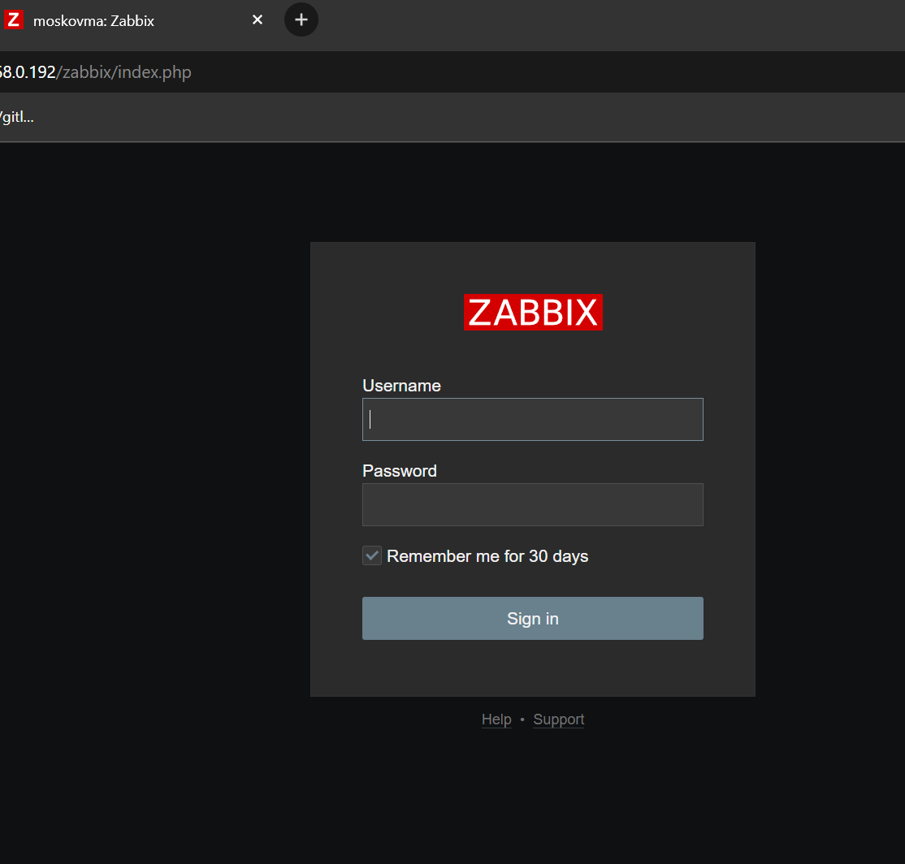
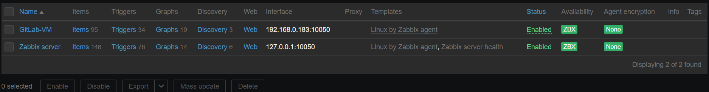
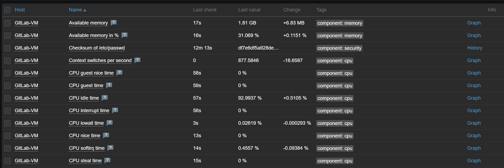
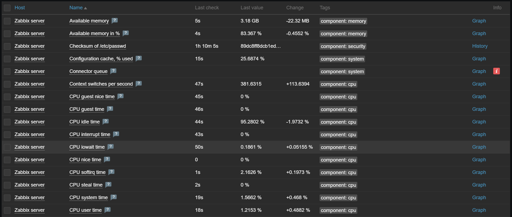
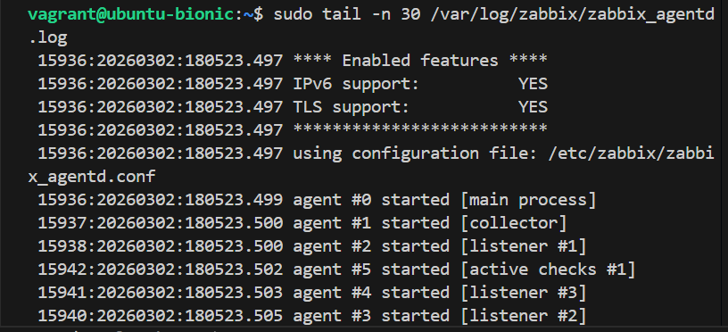
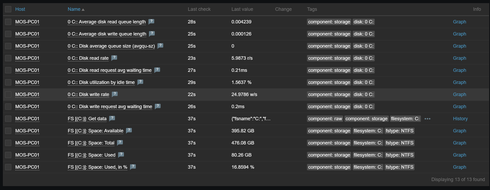

# Домашнее задания "Система мониторинга Zabbix" — Моськов Максим

## Задание 1: Установите Zabbix Server с веб-интерфейсом.

### Описание решения:

### Обновление системы и установка базы данных
sudo apt update && sudo apt upgrade -y
sudo apt install -y postgresql postgresql-contrib

### Добавление официального репозитория Zabbix 7.0 LTS
wget https://repo.zabbix.com/zabbix/7.0/debian/pool/main/z/zabbix-release/zabbix-release_7.0-2+debian12_all.deb
sudo dpkg -i zabbix-release_7.0-2+debian12_all.deb
sudo apt update

### Установка сервера, веб-интерфейса (Apache) и агента
sudo apt install -y zabbix-server-pgsql zabbix-frontend-php php8.2-pgsql zabbix-apache-conf zabbix-sql-scripts zabbix-agent

### Создание пользователя БД (система запросит задать пароль)
sudo -u postgres createuser --pwprompt zabbix

### Создание базы данных zabbix
sudo -u postgres createdb -O zabbix zabbix

### Переход во временную папку (чтобы избежать ошибок прав доступа) и импорт начальной структуры БД
cd /tmp
zcat /usr/share/zabbix-sql-scripts/postgresql/server.sql.gz | sudo -u zabbix psql zabbix

### Редактирование файла конфигурации для указания пароля от БД
sudo nano /etc/zabbix/zabbix_server.conf
### В файле нужно раскомментировать строку DBPassword= и указать свой пароль

### Перезапуск и добавление служб в автозагрузку
sudo systemctl restart zabbix-server zabbix-agent apache2
sudo systemctl enable zabbix-server zabbix-agent apache2

## Задание 2: Установка и настройка Zabbix Agent на два хоста

### Добавление DNS от Google для работы интернета
echo "nameserver 8.8.8.8" | sudo tee /etc/resolv.conf

### Добавление репозитория Zabbix для Ubuntu 18.04 (Bionic)
wget https://repo.zabbix.com/zabbix/6.0/ubuntu/pool/main/z/zabbix-release/zabbix-release_6.0-4+ubuntu18.04_all.deb
sudo dpkg -i zabbix-release_6.0-4+ubuntu18.04_all.deb

### Обновление пакетов и установка агента
sudo apt update
sudo apt install -y zabbix-agent

## 2. Настройка конфигурационного файла агента

sudo nano /etc/zabbix/zabbix_agentd.conf

### В файле были изменены следующие параметры (указан IP-адрес Zabbix-сервера и имя хоста):

- Server=192.168.0.192
- ServerActive=192.168.0.192
- Hostname=GitLab-VM

## 3. Настройка сетевой связности (Troubleshooting)
Так как машины находились в разных виртуальных сетях, к Ubuntu был добавлен второй сетевой адаптер (Сетевой мост) для связи с Zabbix-сервером.

### Включение нового сетевого интерфейса enp0s9
sudo ip link set enp0s9 up

### Запрос IP-адреса по DHCP для новой сети
sudo dhclient -v enp0s9

### Проверка полученного адреса (получен 192.168.0.183)
ip a

### 4. Запуск агента и применение настроек

sudo systemctl restart zabbix-agent
sudo systemctl enable zabbix-agent

### 5. Добавление хоста в веб-интерфейсе Zabbix
Хост GitLab-VM был успешно добавлен в панель управления сервером с использованием шаблона Linux by Zabbix agent. Связь установлена успешно (индикатор ZBX горит зеленым).

**Лог работы Zabbix Agent на хосте GitLab-VM:**

### Задание 3* (со звездочкой): Установка Zabbix Agent на Windows

**Выполнение:**
Агент был успешно скачан и установлен на хост с ОС Windows (MOS-PC01). В настройках агента был указан IP-адрес Zabbix-сервера для активных и пассивных проверок. Узел сети добавлен в веб-интерфейс Zabbix с использованием шаблона `Windows by Zabbix agent`. 

Получение метрик успешно проверено в разделе Latest data.

**Скриншот раздела Latest Data (Свободное место на диске C:):**

